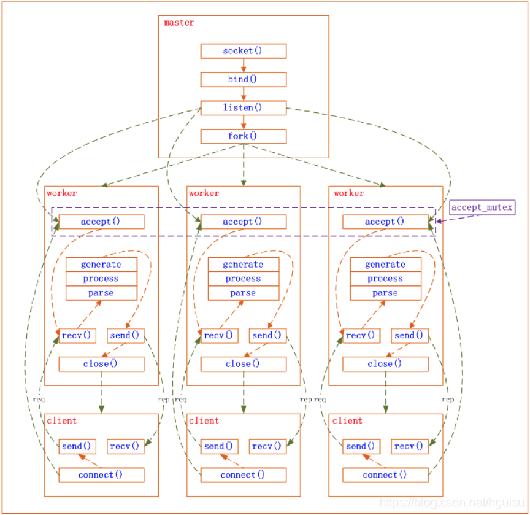

# Nginx多进程

Nginx是标准的多进程模型，通过一个master来管理多个work子进程，子进程用于处理请求。

&#x20;      Nginx启动之后，首先会创建一个master进程，并创建需要监听的socket,这里就是我们创建socket的基本操作，bind对应的ip和端口，调用listen，随后master会fork一定数量的子进程，即worker，worker的数量是可以在配置文件中配置的，当然一般情况下为了避免进程上下文切换，基本上都是CPU核数。fork出的子进程会继承master资源，这其中也包括相同的socket，这时所有的worker复用了相同的ip和端口。

&#x20;     此时的模型就是一个master，多个worker的多进程模型。其中master的作用就是为了接收外部的信号，监听worker的状态，负责worker的管理。Worker就是实际处理客户端请求的进程。

.png>)

&#x20;     上面提到master要监听管理worker，这就涉及到进程间通信机制了，Nginx主要是采用三种方式来实现进程间通信：共享内存、信号和套接字。SocketPair是由数组组成的，fd\[0]用于master写入，fd\[1]用于worker进程读取。不过这里额外说一句，虽然Nginx提供了这种机制，但还是用的比较少，主要是通过信号和共享内存来完成IPC。

&#x20;     当外界来一个信号，比如nginx reload重新加载配置文件，master会重新加载配置，并启动新的worker，随后告知旧的worker关闭。

&#x20;     Nginx通过多进程+单线程（内部使用IO多路复用）来实现高并发处理，目前也是基本上取代了Apache，成为了应用最广泛的反向代理。在第四章节会对IO多路复用进行详细的介绍。

&#x20;      当然还要说的是惊群效应，这是多进程非常常见的一个问题。即多个进程会在同一时间被唤醒，然而实际上是不需要唤醒所有进程的。在Nginx中，是利用互斥锁来解决的,只有获取到互斥锁的worker才能够处理链接，而这个互斥锁是存储在共享内存中。

&#x20;      惊群效应无处不在，可能会在多进程，多线程等多种场景下存在，比如在ZK中，为了避免持有锁的线程释放锁后，多个线程同时争抢锁，通过临时节点序号来保证获取锁的先后顺序，从而避免了惊群效应。

