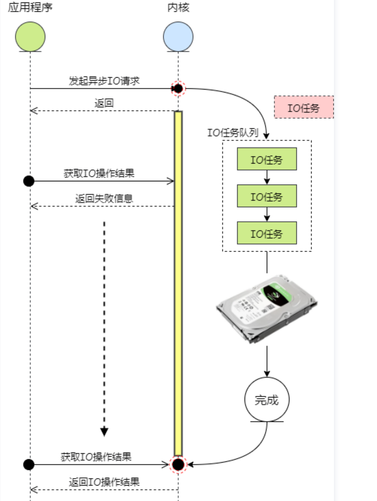

# I/O模型介绍

&#x20;  根据在IO流程的两个阶段的不同处理方式，可以将IO模型划分为以下几种：

* 阻塞式I/O；
* 非阻塞式I/O；
* I/O多路复用（select，poll，epoll...）；
* 异步I/O；
* 信号驱动IO

&#x20;      其中阻塞式、非阻塞式、I/O多路复用本质上都是同步的，和异步I/O有本质区别。接下来就以Socket编程为例逐一介绍这几种模型。


### **1、阻塞式I/O**

&#x20;      默认情况，socket是阻塞式I/O，数据接收函数recv会一直阻塞等待客户端发送数据，在未收到数据前，就一直阻塞，直到收到数据后，recv才返回。随后，将数据从内核空间转为用户空间，进程拿到数据后开始处理数据。从准备数据到拷贝数据这整个流程中，IO操作都是阻塞的，应用程序不可执行其他任务。

<figure><figcaption></figcaption></figure>

&#x20;      当我们建立一个Socket Server时，如果不使用多进程或者多线程，一个Server一次只能处理一次请求。如下面例子：

Server

```python
import socket


class BaseSocket(object):
    def __init__(self,host,port,trans_type='TCP'):
        self.host,self.port = host,port
        if trans_type == 'TCP':
            self.socket = socket.socket(socket.AF_INET,socket.SOCK_STREAM)
        elif trans_type == 'UDP':
            self.socket = socket.socket(socket.AF_INET,socket.SOCK_DGRAM)

import traceback
from basesocket import BaseSocket
import select


class Server(BaseSocket):

    def __init__(self,host,port,trans_type='TCP'):
        super(Server,self).__init__(host,port,trans_type)

    def run(self,connect_num=1):
        self.socket.bind((self.host,self.port)
        self.socket.listen(connect_num)
        while True:
            try:
                clientsock,cliendaddr = self.socket.accept()
            except KeyboardInterrupt:
                raise
            except:
                print traceback.print_exc()
                continue
            print 'Get connection from {0}'.format(clientsock.getpeername())
            while True:
                recv_data = clientsock.recv(1024)
                if recv_data == 'q':
                    print 'Client {0} has exited'.format(clientsock.getpeername())
                    break
                clientsock.sendall(raw_input('Server:'))
            clientsock.close()
```

&#x20;      看上述服务器的这段代码，当已经有一个客户端建立连接后，此时若有其他客户端发出请求，如果已连接的客户端不断开，服务器就不会响应其他客户端，其他的客户端请求只能被阻塞住。

&#x20;      可以看到，这种阻塞式的IO处理模式性能非常差，因为其只能串行的一个一个处理请求。不过在实际开发中可通过多进程或者多线程的方式来提高并发性能。

### **2、非阻塞式I/O**

&#x20;     对于非阻塞，书中给出定义：“  进程把一个套接字设置成非阻塞是在通知内核，当所请求的I/O操作非得把本进程投入睡眠才能完成时，不要把进程投入睡眠，而是返回一个错误。 ”这里强调非阻塞只是在数据准备的过程。

&#x20;     如果将socket设置成非阻塞，那么recv总是立即返回，如果数据没有准备好，就会一直发送错误。注意，这里强调的是如果没有数据，虽然立即返回了，但还回一直不断重试，直到数据准备好。

<figure><figcaption></figcaption></figure>

我们把第一个代码稍微变动一下，将I/O设置成非阻塞的。

```python
class Server(BaseSocket):

    def __init__(self,host,port,trans_type='TCP'):
        super(Server,self).__init__(host,port,trans_type)


    def run(self,connect_num=1):
        self.socket.bind((self.host,self.port))
        self.socket.listen(connect_num)
        while 1:
            try:
                clientsock,cliendaddr = self.socket.accept()
                #将socket设置成非阻塞
                clientsock.setblocking(False)

            except KeyboardInterrupt:
                raise
                
            while 1:
                try:
                    recv_data = clientsock.recv(1024)
                except:
                    print 'Server can not receive data from client data '
                    continue
            
                print 'Client:{0}'.format(recv_data)
                clientsock.sendall(raw_input('Server:'))
            clientsock.close()
                
```

&#x20;     看上面代码，我们设置成了非阻塞，如果对方没有准备好数据的时候，recv就会返回一个错误，直到Server检测到客户端准备好数据了。它和阻塞的区别是在数据准备阶段不是一直阻塞，而是如果数据没有准备好，会返回一个错误码。然后不断轮询，直到数据准备好。

&#x20;     这种I/O模式由于其需要不断地发起read系统调用，导致不断地需要在内核空间和用户空间之间切换，虽然用户态和内核态之间的上下文切换相比于进程或者线程间上下文切换，代价要i小一些，但频繁的调用还是会影响性能的。我们看下切换的过程：

* 保留用户态现场（上下文、寄存器、用户栈等）
* 复制用户态参数，用户栈切到内核栈，进入内核态
* 额外的检查（因为内核代码对用户不信任）
* 执行内核态代码
* 复制内核态代码执行结果，回到用户态
* 恢复用户态现场（上下文、寄存器、用户栈等）

&#x20;      从上面的流程中可以看到，用户态和内核态之间的上下文切换还是有一定代价的。因此非阻塞I/O性能并不是很好，在实际场景中也不常用。

&#x20;    注意这个非阻塞NIO和JAVA中的NIO，完全不是一个概念，JAVA的NIO是New IO是基于下面的多路复用实现的一种方式。


### 3、I/O多路复用

&#x20;      I/O多路复用是指内核一旦发现进程指定的一个或者多个IO条件准备读取，它就通知该进程 。在这种并发编程中，应用程序在一个进程的上下文内部进行调度，所有的流共享同一套地址空间。

&#x20;      与多进程和多线程技术相比，I/O多路复用技术的最大优势是系统开销小，系统不必创建多个进程或者线程，也不必维护这些进程或者线程，更不存在进程或线程间的切换，从而大大减小了系统的开销。

&#x20;      I/O复用，操作系统 通过一种机制，可以监视多个描述符(socket)，一旦某个描述符就绪（一般是读就绪或者写就绪），能够通知程序进行相应的读写操作。文件描述符是Linux中的一个概念。在Linux中，一切都是文件，比如一个socket文件。文件描述符表示了打开文件的索引，指向的是对应的文件。文件描述符有系统级的还有进程级的。

&#x20;      一个 Linux 进程启动后，会在内核空间中创建一个 PCB 控制块，PCB 内部有一个文件描述符表（File descriptor table），记录着当前进程所有可用的文件描述符，即当前进程所有打开的文件。

&#x20;     目前IO多路复用机制包括select，poll，epoll，kqueue等。其共同特点都是通过某种方式获取到已经就绪的文件描述符，随后通知用户进程，通常也把此模型叫做事件驱动型。只不过这几种机制获取就绪文件的描述符的方式是不同的，具体会在下一章节介绍。

<figure><figcaption></figcaption></figure>

### 4、异步I/O <a href="#articleheader13" id="articleheader13"></a>

&#x20;       在介绍异步I/O模型前，要看下同步 IO和异步 IO的区别。POSIX的定义是这样子的：

&#x20;  ``   - A synchronous I/O operation causes the requesting process to be blocked until that I/O operation completes;\
&#x20;       \- An asynchronous I/O operation does not cause the requesting process to be  blocked;  `` &#x20;

&#x20;      同步 I/O在执行I/O操作的时候会将进程阻塞，也就是说进程需要同步完成read操作，而一个完整的read包括数据准备和数据拷贝两个阶段。按照这个定义，之前所述的阻塞式I/O，非阻塞式I/O，I/O多路复用都属于同步I/O。

&#x20;       异步I/O则不同，进程会将I/O操作交给内核做，自己可以去做其他的工作，直到内核完成了数据从内核空间到用户空间的拷贝，通过发出信号告诉进程已经完成，进程再去执行相应业务处理。也就是说，进程发起read系统调用后，不必再等待数据返回，而是可以继续去做其他的工作。由此可见，异步I/O模型要比同步I/O模型的性能更好。具体流程可见下图：

<figure><figcaption></figcaption></figure>

&#x20;      Linux之前是不支持异步I/O的，即便到现在，在linux中 可以实现异步I/O，很多的应用程序依然是使用linux的I/O多路复用机制来实现并发。单就这一点来看，Windows系统就完美支持异步I/O。

&#x20;      目前Linux主要有三种方式来实现异步I/O:

&#x20;  1、第三方库实现的异步。libeio，glibc aio等。通过多线程模拟异步IO；

&#x20;  2、Linux AIO，内核实现的异步IO，是Linux2.6+引入的

&#x20;      主要通过io_submit和io\__getevents两个函数来实现的。

* 1\) 调用 `io_submit` 函数发起一个异步 IO 操作。
* 2\) 调用 `io_getevents` 函数获取异步 IO 的结果。

&#x20;&#x20;

<figure><figcaption></figcaption></figure>

&#x20;       Linux AIO看似比较好，但其存在的缺点仍然不容忽视，如只支持ODIRECT模式，如果之前看过我写的零拷贝的文章的同学就会知道，使用O\_DIRECT方式直接绕过了PageCache，如果是数据库应用，由于其自身实现了进程内缓存，完全是OK的，那对于非自身实现用户空间缓存的应用来说，是致命的，因为不能利用页缓存，性能会变得非常差。

3、io\_uring，异步IO框架，是Linux5+引入的

&#x20;     该功能提出得比较晚，其通过两个队列来实现，一个是待处理得I/O任务队列，另一个是已处理完成得队列。

<figure><figcaption></figcaption></figure>

由于其提出比较晚，因此现在应用也不是特别多，感兴趣得可以看下这篇文章：[https://arthurchiao.art/blog/intro-to-io-uring-zh/#15-%E5%BC%82%E6%AD%A5-ioaio](https://arthurchiao.art/blog/intro-to-io-uring-zh/#15-%E5%BC%82%E6%AD%A5-ioaio)


### 5、信号驱动IO

&#x20;     信号驱动I/O模型会预先通知内核，在数据准备的过程中，并不需要等待，而是可以执行其他任务，待数据已经准备号后，内核给用户进程发松一个SIGIO信号，用户进程通过系统调用完成数据从内核空间到用户空间的拷贝。

<figure><figcaption></figcaption></figure>

&#x20;      由此可见，相对于其他的同步I/O方式，其在性能上还是不错的。这里要说的一点是套接字编程中的信号驱动I/O模型的使用。我们都知道Socket包括TCP和UDP两种，而信号驱动IO模型通常适用在UDP中，TCP中使用并不合适。这是因为TCP中的事件比较多，包括连接建立、释放、数据到达等等，此时会频繁产生多种信号，不幸的是，SIGIO信号并没有告诉用户进程此时是什么事件就绪了。反观UDP，其只包括数据报文到达和Socket异常，因此事件比较明确。

&#x20;      最后还要注意信号驱动I/O和异步I/O的区别，信号驱动只是在数据准备阶段不需要等待，在数据拷贝过程还是要同步执行的；而异步I/O在整个IO操作中都不需要等待。

